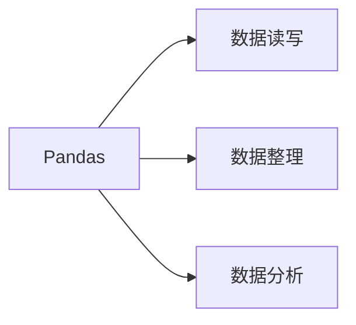

# 文本分析

# 第一讲 文本分析初步


## 文本数据的分布

### 文本分布在一下的情景里面：


文本分析所获得的文本可以在书籍中或者在网络的环境中获取，获取文本后经过一系列的方法进行文本分析。

分析后可以制作成图云的形式，可视化在我们的眼前。


### 文本数据的普遍性：

- 微博、微信
- 论坛、博客
- 商品评价
- 投诉文本
- 电子邮件
- 调查问卷开放问题
- 新闻媒体
- 法律判决文书
- 档案材料
- 会议发言
- 政府文件

### **==文本分析的重要性==**：

- 与结构化数据结合，提升决策和预测模型的准确性
  - 结合互联网舆情与法院判决信息/股价信息等，评判企业发展前景
  - 结合交易流水信息，提高消费者画像精确度
  - 预测国会选举、投票率等
- 人工智能系统
  - 自然语言处理（nlp)
  - 文本分析
  - 语言分析是核心技术


### 文本分析的挑战性：

- 分析对象局限性
- 分析语句局限性大
  - 一词多义：需要结合上下文才能理解。
  - 多词多义：”发货速度快”，”物流超级赞”，”物流迅速”
- 维度灾难
  - 向量空间模型及其高维，而且非常稀疏

- 语言表达的随意性
  - 蓝瘦香菇、yyds、老司机


## 文本数据的预处理

### 文本分析中的主要问题

- 分词和词性标注
- 信息抽取
- 文本分类和聚类
- 语义分析
- 主题分析
- 情感分析
- 机器翻译


### 文本分词

文本分词是预处理过程中必不可少的一个操作，因为后续的分类操作需要使用文本中的单词来表征文本

> 分词分析是自然语言处理技术的基础，其性能将直接影响句法分析及其后续应用系统的性能。中文的词是能够独立运用的最小的语言处理单位。

文本分词包括两个步骤：

- 词典构造
- 分词算法的操作

例：今天的天气真的很好。--> 今天/的/天气/真的/很好.

#### 词法分析研究面临的问题：

1. 从中文语言的特点来看，第一因为中文各词之间不存在显式的分界符，所以中文需额外的分词过程；第二，中文缺少英文中类似-ed，-ing，人名首字母大写等丰富的词形信息，这将导致标注中文词性是可用的信息少
2. 从外在因素看，中文自然语言处理研究起步较晚，目前还未达到英文所具有的的大规模公开的评测机制与规范的评测语料
3. 从词法分析本身来看，分词面临着切分歧义问题与未知词识别问题；词性标注主要面临复杂兼类词消歧与未知词标注问题


#### 一体化中文词法分析框架

- `分词`：序列切分的过程
- `词性标注`：序列标注的过程
- `命名实体识别`：不仅需要识别实体的边界，还需要识别实体的类型

一体化处理流程:

1. 分词、词性标注、命名实体识别之间的协调处理能够改善整个词法分析系统的性能。
2. 采用易于融合更多统计特征与语言知识的模型有助于改善词法分析系统的性能
3. 恰当的特征集有助于改善词法分析系统的性能

综上三种观点：从易于利用领域知识以及构建实用化词法分析系统的角度出发，采用各个子任务协作处理的方法构建实用化分析系统。


==具体实现;== python 中安装 jieba

### 去停用词

去停用词也是预处理过程中不可缺少的一部分

因为并不是文本中每一个单词或字符都能表征这个文本，比如说”这个”、”的”、”我 你 他”等等，这些词应该从文本中清除。

停用词可以使用百度的停用词或者哈工大的停用词

### 文本特征提取

- 特征项提取，把词条中最能代表某类文本信息的词条挑选出来，作为文本的特征项。

>  实验结果表明特征项不但不会使分类结果准确率减低，而且还会使结果更加准确

在文本处理中，一些常用特征提取评估函数有文档频数、信息增益、统计、文本证据权等

### 文本向量化

> 向量空间模型由 salton 等人于 20 世纪 70 年代提出，并成功应用于著名的 SMART 文本检索系统，目前广泛应用在自然语言处理中。

具体而言，每一个词语表达一个维度，取值表示该词语的出现频次或者是否出现。

- 词袋模型（bag of word）
  - 将文本表示成为词典维度大小的高维向量，用 0 或 1 来表示。通俗来讲，就是把一篇文章看成词袋，里面装着一个个的词。从而，将一篇文档转化成了一个个的词。显然地，文档转化成一个个的词之后，词与词之间的顺序关系丢失。
- TF 模型
  - TF（term frequency），是指该词语（term）在某篇文档中出现的频率。TF（t，d）代表了 term 在document 中出现的词数，反映出该词语的重要程度。
- TF-IDF 模型
  - 使用词语在整个文档中的逆文档频率来归一化 TF 权重，以此来消除常用词在文档中权重过大的现象，并由此突出不同文档中的差异


例如：


| 词典     | 词袋模型 | TF模型 |
| -------- | -------- | ------ |
| 教育     | 1        | 2      |
| 问题     | 1        | 2      |
| 关系     | 1        | 1      |
| 国家     | 1        | 1      |
| 发展     | 1        | 1      |
| 大       | 1        | 1      |
| 必须     | 1        | 1      |
| 提高     | 1        | 1      |
| 经费支出 | 1        | 1      |
| 小明     | 0        | 0      |
| 父亲     | 0        | 0      |
| 认真     | 0        | 0      |

### 多个词特征：N-gram

- 把多个词多做单一的特征值
  - N 表示考虑将多少词进行组合
  - 1-gram（unigrams）：公司
  - 2-gram（bigram)：有限公司
  - 3-gram（trigrams）：科技有限公司
- 将词旭纳入考虑
- 维度指数级增长，空间稀疏程度高

> 马尔科夫假设：一个词的出现仅仅依赖于它前面出现的有限的一个或者几个词


### 文本降维

- 在机器学习中需要考虑维度灾难和数据系数的问题
  - 假设词表中有 20000 个词，如果是 bigram 那么可能的 N-gram 就有 400000000 个，如果是 trigram ，那么可能的 N-gram 就有 8000000000000 个
- 对文本的降维处理非常必要，并非越多越好
  - 只选取具体主题的词语
  - 停用词和常用词删除
  - 模型方法


## 文本可视化

> 文本可视化技术综合了文本分析、数据挖掘、数据可视化、计算机图形学、人机交互、认知科学等学科的理论和方法，为人们**理解复杂的文本内容、结构和内在的规律等信息的有效手段**。


使用的软件：Anaconda


## python库

`pandas` 是 python 最重要的数据分析工具包。

`Matplotlib` 和 `seaborn` 是最常用的数据可视化的工具包，解决如何通过数据来绘制图表，来更好的展示数据

`numpy` 是一个用于数值运算的 python 库，专门对数值运算进行优化，最大优势是快。pandas 底层数据结构采用 numpy 来实现，我们也可以把 pandas 理解成是对 numpy 的封装，让数据分析的一些功能的实现变得更容易。

### pandas 简介

pandas 是基于NumPy 的一种工具该工具是为了解决数据分析任务而创建的。Pandas 纳入了大量库和一些标准的数据模型，提
供了高效地操作大型数据集所需的工具。Pandas提供了大量能使我们快速便捷地处理数据的函数和方法。


看一下 pandas 在数据分析方面有哪些作用呢？




Pandas提供的数据结构和函数的设计，将使表格化数据的工作快速、简单、有表现力。所以利用 Pandas 进行数据操作、预处
理、 清洗是Python数据分析中的重要技能.

#### Pandas 的数据结构


不管是Excel还是数据库，他们存储数据的方式都是以表格样式进行存储，有行、有列，并且每一行和每一列都有自己的索引

pandas 的 DataFrame 的结构就和他们相同， Series 的结构和表中的行的结构相同。


在下面的代码中，我们使用代码创建出一套英雄团队

```python
import pandas as pd
#通过series 存储每个英雄的基本信息
#创建series
s1 = pd.Series([1001,"鲁班","18","150.00","男"])
s2 = pd.Series([1002,"小乔","19","167.00","女"])
s3 = pd.Series([1003,"关羽","30","180.00","男"])
s4 = pd.Series([1004,"蔡文姬","20","160.00","女"])
s5 = pd.Series([1005,"兰陵王","22","165.00","男"])

series_list = [s1,s2,s3,s4,s5]

#创建一个DataFrame对象存储通讯录
df = pd.DataFrame(series_list)
```

打印出来的结果：

|      | 0    | 1      | 2    | 3      | 4    |
| ---- | ---- | ------ | ---- | ------ | ---- |
| 0    | 1001 | 鲁班   | 18   | 150.00 | 男   |
| 1    | 1002 | 小乔   | 19   | 167.00 | 女   |
| 2    | 1003 | 关羽   | 3    | 180.00 | 男   |
| 3    | 1004 | 蔡文姬 | 20   | 160.00 | 女   |
| 4    | 1005 | 兰陵王 | 22   | 165.00 | 男   |

分析根据 df 打印出来的结果：

整个数据分为三个部分：行索引（index），列索引（columns）及数据内容（data）

行列索引么有被定义的时候，会用0,1,2，……来定义，索引的作用是为了更好的认知和查询数据


#### Series 的创建

Series是Pandas中最基本的对象，Series类似一种一维数组。事实上，Series 基本上就是基于 NumPy 的数组对象来的。和

NumPy 的数组不同，Series 能为数据自定义标签，也就是索引（index），然后通过索引来访问数组中的数据。接下来我们

开始创建Series，看一看它的结构有什么不同。

一个Series其实就是一条数据，Series方法的第一个参数是data，第二个参数是index(索引)，如果没有传值会使用

默认值（0-N）。

```python
#导入series
from pandas import Series.DataFrame

#创建 Series，使用默认索引
sel = series(data=[1,'TheShy',20,'duuwugdu'])
print(sel)

#定义一个索引
sel1 = series(data=[1,'TheShy',20,'duuwugdu'],index=['排名','Id号','年龄','评语'])
print(sel1)
```


#### DataFrame 的创建

DataFrame （数据表）是一种二维数据结构，数据以表格的形式存储，分成若干行和列，通过 DataFrame ，你能很方便地处理数据。

调用 DataFrame() 可以将多种格式的数据转换为 DataFrame 对象，他的三个参数 data 、index 、columns 分别为数据，行索引、列索引

```python
from pandas import Series,DataFrame

# 创建二维列表存储选手信息
lol_list = [['上单','Theshy',20],
            ['打野','小天',19],
           ['中单','Faker'，23],
           ['ADC','Uzi',22],
           ['辅助','Ming',21]]

#创建DataFrame
df = DataFrame(data=lol_list)
print(df)
```

```txt
     0       1   2
0   上单  Theshy  20
1   打野      小天  19
2   中单   Faker  23
3  ADC     Uzi  22
4   辅助    Ming  21
```

```python
from pandas import Series,DataFrame

# 创建二维列表存储选手信息
lol_list = [['上单','Theshy',20],
            ['打野','小天',19],
           ['中单','Faker'，23],
           ['ADC','Uzi',22],
           ['辅助','Ming',21]]

#创建DataFrame
df = DataFrame(data=lol_list,
              index=['a','b','c','d','e'],
              columns = ['位置','ID号','年龄'])
print(df)
```

运行结果：

```tex
    位置     ID号  年龄
a   上单  Theshy  20
b   打野      小天  19
c   中单   Faker  23
d  ADC     Uzi  22
e   辅助    Ming  21
```

通过结果可以看出字典格式的数据被DataFrame整理后，字典的键将作为数据的列索引值。通过 DataFrame，你可以很方便地处理数据，常见的操作比如选取、替换行或列的数据，还能重组数据表、修改索引、多重筛选等。基本上可以把 DataFrame 理解成一组采用同样索引的 Series 的集合。


总结：

> ```mermaid
> graph LR;
> 第一节课知识点总结-->数据分析定义-->从数据中寻求真正有价值的信息,并对实际工作或者生活有一定的指导作用,这个过程就叫做数据分析
> 第一节课知识点总结-->python数据分析-->方便,高效,应用领域广
> python数据分析-->丰富的第三方数据分析工具包
> 第一节课知识点总结-->pandas数据结构-->Series的创建
> pandas数据结构-->DataFrame的创建
> ```
>
> 


## 练习

### 宇宙第一天团

```python
from pandas import Series,DataFrame

# 创建二维列表存储宇宙第一天团的信息
us_list = [['小明','男一','改天换日','世上无难事，只怕有心人'],
            ['小麦','男二','只手遮天','打不死我的，必使我坚强']
           ]

#创建DataFrame
df = DataFrame(data=us_list,
               index=['a','b'],
               columns = ['姓名','饰演','技能','语录'])
print(df)
```


```python
#运行结果：
   姓名  饰演    技能           语录
a  小明  男一  改天换日  世上无难事，只怕有心人
b  小麦  男二  只手遮天  打不死我的，必使我坚强
```


### 渣男备忘录

```python
from pandas import Series,DataFrame

#创建二维列表存储渣男语录
sc_quo = [['渣男一','你这样的女生我见的多了'],
         ['渣男二','宝贝，等等我好吗'],
         ['渣男三','我下次不会这样了，别这样好吗？']]

# 创建 DataFrame
df = DataFrame(data = sc_quo,
              index = ['1','2','3'],
              columns = ['渣男名字','渣男语录'])

print(df)
```


```python
 # 运行结果：
    渣男名字             渣男语录
1  渣男一      你这样的女生我见的多了
2  渣男二         宝贝，等等我好吗
3  渣男三  我下次不会这样了，别这样好吗？
```


# 利用 pandas 的输入数据和写入Excel
前引：在做数据分析的时候，Excel是我们最常用的工具，但是当数据量比较大的时，Excel光把数据文件打开就要很久很久，那么利用Pandas就会非常高效。

## 数据的写入
我们可以将数据写入到文件中进行永久性的保存，支持的文件格式有HTML、CSV、JSON、Excel。
csv是最为常见的以纯文本文件存储数据文件的格式，它的优点是==通用性很强==，不受操作系统以及具体的软件的限制。我们以写入csv为例，看一下pandas是如何是将数据写入csv文件中。


```python
# 本节核心代码
df.to_csv(path_or_buf = './test.csv',encoding = 'utf_8_sig')

```

在上面的代码里，我们创建了一个DataFrame，接着通过to_csv()方法将DataFrame保存为csv文件。从结果中可以发现，to_csv()保存数据时，df的行索引作为一列被输出到csv文件中。
设置 `encoding = 'utf_8_sig'`的原因：在 to_csv（）方法生成CSV文件的时候，打开文件时都是乱码，encoding 参数设置 'utf_8_sig'后乱码就会消失。

那如何操作可以使索引列不被输出呢？
解决方法：
在 to_csv 方法中将参数index 设置为 False 就可以不存储 DataFrame 的行索引信息

## CSV 数据的读取
核心代码：
```python
df = pd.read_csv('CSV的路径')
```
- 数据的存储我们发现很简单，调用to_csv()后设置文件存储路径后就可以了。
- 调用read_csv()方法并传入文件的路径，就可以将数据读取出来并且是DataFrame类型。
- 还可以看出，read_csv()默认会将文件中的第一行作为数据的列索引。


如果csv文件的第一行或者其他行不满足我们的需求时，我们要自己修改。

* 利用 read_csv() 中的 header 参数进行选择哪一行作为我们的列索引：*
```python
import pandas as pd
people = pd.read_csv('文件路径',header = 0)
# header 后面跟着某一行的位置索引，位置索引从 0 开始
```
read_csv()的header参数默认是0，取第一行的值，可以根据具体的要求设置header的值来确定列索引。
如果都不满足的你的要求，可以将header设置为None，列索引值会使用默认的1、2、3、4，之后在自行设置。


当指定了 header 的值，读出来的数据就是从该行开始向下切片，该行以上的数据就会被忽略。

## Excel 数据的读取
注意：
一个 Excel 文件可以创建多个表，然后在不同的表中存储不同数据，这种形式的文件很常见。但是要注意 CSV 文件不存在多个 sheet 的问题。
所以，在读取Excel 表格的时候，需要注意读取的是哪一个表格

Excel文件的读取和csv的读取方式相似，read_csv()读取csv文件，read_excel()读取Excel文件。

```python
# 核心代码
import pandas as pd

sheet = pd.read_excel('数据地址',sheet_name = 'sheet1')
print(sheet.head())

# sheet_name 后面填写表格的名字，如果是默认的名字就填默认的名字，如‘sheet1’；如果名字更改了，需要跟着更改的名字一样
```
- to_csv()会比 to_excel() 少一个 sheet_name 的参数，这个参数就是可以指定表的名字。
- 在上面的代码里，我们引入了带有两个表的sheet.xlsx的Excel文件，两个表名分别为'sheet1'，'sheet2'，然后我们通过指定sheet_name的值，获取不同表中的数据。

## csv 文件输出：
```python
dataframe.to_csv('new_csv.csv')
```


> 总结：
> 数据写入：
> 1. 永久保存，支持的文件格式：HTML、CSV、JSON、EXCEL
> 2. to_csv()的 path_or_buf 参数：需要指定的文件的本地路径
> 3. to_csv()的index 参数：设置为 False 就可以不存储DataFrame 的行索引信息
> 4. to_csv() 的 encoding() 参数：设置"utf_8_sig" 后解决文件打开乱码问题
>
>  数据读取
>  1. 使用 read_csv()、read_excel() 等方法读取
>  2. read_csv() 第一个参数填文件的路径
>  3. 默认会将文件中的第一行作为数据的列索引，使用 header 参数设置（指定行位置索引，none）
>  4. 一个 Excel 文件可以存在多个表，一个 CSV 只有一个表，所以在打开 Excel 文件的时候，要注意表的名字
>  5. 读取某个表时，使用 sheet_name = '' 指定

 ## 练习一：组建球队
 题目要求：从数据集中选取5个球员，组成自己的球队
 分析过程：
 - 球员信息的存储路径需要知道
 - 打印前 5 条了解数据的基本信息
 - 随机获取 5 条数据
 - 代码实现
```python
import pandas as pd
import random

# 读取数据
player = pd.read_csv('')

# 打印前 5 行数据，了解数据基本信息
print(player.head())

# 随机获取 5 条信息
index_list_random = player.index.tolist()

for i in range(0,5):
  value = index_list_random[random.randint(0,len(index_list_random))]
  msg = player.iloc[value]
  print(msg)
```

## 练习二 统计导演个数
题目要求：读取电影信息的CSV 文件，统计出数据集中共有多少个导演

```python
import pandas as pd
import random

# 读取数据
movie = pd.read_csv('文件路径')
# 了解数据信息
print(movie.head())

# 获取导演信息，转换成列表
directors = movie['directors_name'].tolist()

# 去重,这里用集合去重
num = set(directors)
print(len(num))
```


# 数据的删除
引言：我们分析的数据来源有很多种，例如：爬取、公司数据库、数据公司等。但是这些数据中有些数据项是我们不需要的，甚至可能会存在重复数据和空值的情况。

这一节的目标：如何删除多余的数据和重复数据以及空值的处理
如果文件的单元格中没有值时，在使用pandas读取后就会用NaN表示，也就是我们常说的空值。

## 创建空值
代码实现：
```python
from numpy import nan as NAN
# 查看 NAN 的数据类型
print(type(NAN))
```
对于大批量的Series数据，使用肉眼很难判断空值的存在，这时我们可以先对空值进行过滤。请运行下方代码，查看过滤的方法：
```python
from numpy import nan as NAN
import pandas as pd

se = pd.Series([4,NAN,NAN,5])
print(se.notnull())

print(se[se.notnull()])
# 读取 Excel 数据
df = pd.read_excel('C:\Users\morang\Desktop\2020级二课学分汇总.xlsx')
# 了解数据的行列数量
print(df.shape)
# 查看数据的前5行数据
print(df.head())
```


## 删除某几行
如果只是单纯的想删除数据，我们可以使用df.drop()方法，一起来了解一下该函数。
代码片段`DataFrame.drop(labels=None,axis=0, index=None, columns=None, inplace=False)`
01. labels ：就是要删除的行列的名字，用列表给定。
02. index： 直接指定要删除的行。
03. columns： 直接指定要删除的列
04. inplace=False：默认该删除操作不改变原数据，而是返回一个执行删除操作后的新dataframe。
05. inplace=True：则会直接在原数据上进行删除操作，删除后无法返回。


两种删除行列的方式：
- `labels = None,axis = 0`
- index 或 columns 直接指定要删除的行或列

```python
import pandas as pd
df = pd.read_excel()
# 删除第 0 行和第 1 行
df.drop(labels=[0,1],axis = 0)

# 删除列名为 1990 的列
df.drop(axis = 1,columns = 1990)

```
## 空值的处理
对于空值，我们可以将整条数据删除，也可以使用 fillna() 方法对空值进行填充
核心代码：
```python
df.fillna(value = None,method = None,axis = None,inplace = False,limit = None,downcast = None)
```
* 注意：method 参数不能与 value 参数同时出现  *
## 重复数据的处理
   重复数据的存在有时不仅会降低分析的准确度，也会降低分析的效率。所以我们在整理数据的时候应该将重复的数据删除掉。
   利用 duplicated() 函数可以返回每一行判断是否重复的结果（重复则为True)。
   
运行下面的代码，观察结果是否有重复数据：
```python
import pandas as pd
df = pd.read_excel('')
# 返回结果
print(df.duplicated())
```
通过结果我们发现，返回的是一个值为 Bool 类型的 Series ，如果当前行所有列的数据与前面的数据是重复的就返回True；反之，则返回False。


- 可以使用 drop_duplicates()将重复数据进行删除：`df.drop_duplicates()`
- 可以只通过判断某一列的重复数据，然后进行删除：`df.drop_duplicates(['CountryName'],inplace = False)`
-   其中 ['CountryName'] 表示对比 countryname 列数据是否有重复，inplace 用来控制是否直接对原始数据进行修改

> 小结：
> 删除数据：
> df.drop()删除一行或一列数据
> axis 有两个参数：0,1；0表示删除行，1表示删除列，默认是0
> inplace：是否在当前 df 中执行此操作，True 表示在原来数据基础上修改，False 表示返回一个新的值，不修改原有数据
> 
> 空值处理：
> df.dropna()只要含有 NaN 的整行数据删掉
> 参数 how='all'，删除整行都是空值的数据
> axis 参数，axis = 1 表示列，axis = 0表示行
> 参数 threah = n 保留至少有 n 个非 NaN 数据的行
> 
> 移除重复数据
> duplicated()检测数据是否为重复的数据行
> 通过 DataFrame 的 duplictaed() 去除重复行数据
> f.drop_duplicates(['A'])只判断某一列数据中是否重复


## 上机练习


```text
1. 读取数据文件并查看数据信息
- name：国家的名称
- iso_a3：三个字符 ISO 3166-1 国家代码
- currency_code：三个字符 ISO 4217 货币代码
- local_price：巨无霸本地货币的售价
- dollar_ex：本地货币相对于 1 美元的汇率
- GDP_dollar：人均 GDP，单位为美元
- date：观测和采集数据的时间
```
```python
import pandas as pd
df = pd.read_csv('./big-mac-source-data(1).csv')
df.head()

# 2.我们发现 GDP_dollar(美元)有大量的缺失值,我们可以直接将这一列数据删除掉
# 删除 列
df1 = df.drop(axis=1,index=None,columns='GDP_dollar')
df1.head()

# 3.对于其他列的少量缺失值,我们可以删除这一行
# 删除 缺失值，这个是在表格中观察看到哪里是空值，用表格的形式把行号写出来，赋值给labels
df2 = df1.drop(labels = [0,1,2,3,],axis=0)

# 4.我们在对数据操作之前需要先查看数据是否有重复
print(df2.duplicated())

# 5.对与重复的数据我们把重复数据删除掉
df3 = df2.drop_duplicates()
print(df3)

# 6.最后我们把处理好的数据保存成为新的csv
df3.to_csv('new_csv.csv')

```


## 绝对路径&相对路径
读取的文件路径通常会涉及到两种，一种是相对路径，一种是绝对路径。

先说一下相对路径的情况：

了解相对路径之前，需要先了解什么是当前工作目录，当前工作目录是指当前文件所在的目录。比如demo.py文件所在的目录。相对路径就是依赖于当前工作目录的。如果在当前目录下（demo.py所在的目录）有一个名称为msg.txt的文件，那么读取这个文件代码可以如下图这样写：


如果在当前目录下（demo.py所在的目录）下有一个子目录resource,并且在该子目录下保存着msg.txt文件，那么在读取msg.txt文件时，代码应当如下图这样写：


说明：指定文件路径时需要对路径分隔符“\”进行转义，即将路径中的“\”替换为"\\",也可以将路径分隔符"\"采用"/"代替。所以上图中两种路径的书写方式都是正确的。

再看一下绝对路径的情况：

绝对路径是指在使用文件时指定文件的实际路径，它不依赖于当前工作目录。你只需查看msg.txt文件所在的实际具体位置就可以。比如msg.txt文件在F盘test文件夹下，代码可以如下图这样写：

综上所述，在Python中读取指定路径下的txt文件内容，你无论采用相对路径方式还是采用绝对路径方式，都可以读取到指定路径下的文件内容。
